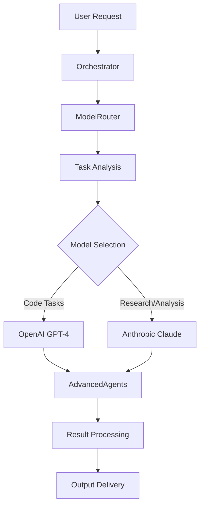

# AI Workflows Guide

This guide provides comprehensive documentation for all 8 AI workflows available in the Cartrita McDaniels system. Each workflow is designed to automate specific development tasks using intelligent AI orchestration.

## Overview

The workflow system uses the **Orchestrator** component to coordinate multi-step AI operations, with automatic model selection between OpenAI and Anthropic based on task requirements.

### Workflow Architecture



## Available Workflows

### 1. Code Review Workflow (`code-review`)

**Purpose**: Automated code analysis, review, and improvement suggestions

**Use Cases**:
- Pre-commit code reviews
- Quality assurance checks
- Security vulnerability detection
- Performance optimization recommendations

**Process**:
1. **Code Analysis** - Examines code structure, patterns, and quality
2. **Security Scan** - Identifies potential security vulnerabilities
3. **Performance Review** - Analyzes for performance bottlenecks
4. **Best Practices Check** - Validates against coding standards
5. **Improvement Suggestions** - Provides actionable recommendations

**CLI Usage**:
```bash
npx cartrita-ai workflow --workflow=code-review
npx cartrita-ai workflow --workflow=code-review --context="Review authentication module"
```

**API Usage**:
```bash
curl -X POST http://localhost:3000/api/v1/ai/workflow \
  -H "Content-Type: application/json" \
  -d '{
    "workflow": "code-review",
    "context": "Review recent changes in src/auth/",
    "priority": "high"
  }'
```

**Expected Output**:
- Detailed code analysis report
- Security vulnerability assessment
- Performance improvement suggestions
- Code quality metrics
- Actionable fix recommendations

---

### 2. Research Implementation Workflow (`research-implement`)

**Purpose**: Research-driven feature development with comprehensive analysis

**Use Cases**:
- Implementing new features with best practices research
- Technology evaluation and selection
- Architecture decision documentation
- Competitive analysis integration

**Process**:
1. **Requirements Analysis** - Breaks down feature requirements
2. **Technology Research** - Researches best practices and solutions
3. **Architecture Planning** - Designs implementation architecture
4. **Code Generation** - Generates initial implementation
5. **Testing Strategy** - Creates comprehensive test plans
6. **Documentation** - Produces detailed documentation

**CLI Usage**:
```bash
npx cartrita-ai workflow --workflow=research-implement
npx cartrita-ai generate --type=feature --name="User Authentication" --research=true
```

**API Usage**:
```bash
curl -X POST http://localhost:3000/api/v1/ai/workflow \
  -H "Content-Type: application/json" \
  -d '{
    "workflow": "research-implement",
    "feature": "Real-time chat system",
    "requirements": ["scalable", "secure", "real-time"],
    "technologies": ["fastify", "socket.io", "redis"]
  }'
```

**Expected Output**:
- Comprehensive research report
- Architecture diagrams and decisions
- Complete implementation code
- Test suite with coverage
- Technical documentation
- Deployment guidelines

---

### 3. Full Feature Development Workflow (`full-feature-dev`)

**Purpose**: End-to-end feature development lifecycle automation

**Use Cases**:
- Complete feature development from concept to deployment
- Full-stack implementation with frontend and backend
- Database schema design and implementation
- API endpoint creation and documentation

**Process**:
1. **Feature Planning** - Creates detailed feature specification
2. **Database Design** - Designs schema and migrations
3. **API Development** - Implements RESTful endpoints
4. **Frontend Components** - Creates UI components
5. **Integration Testing** - Develops integration test suite
6. **Deployment Preparation** - Prepares deployment configuration

**CLI Usage**:
```bash
npx cartrita-ai workflow --workflow=full-feature-dev
npx cartrita-ai generate --type=full-feature --name="User Dashboard"
```

**API Usage**:
```bash
curl -X POST http://localhost:3000/api/v1/ai/workflow \
  -H "Content-Type: application/json" \
  -d '{
    "workflow": "full-feature-dev",
    "feature": "User Profile Management",
    "stack": ["typescript", "fastify", "postgresql", "react"],
    "requirements": ["CRUD operations", "file uploads", "validation"]
  }'
```

**Expected Output**:
- Database migrations and models
- Complete API endpoints
- Frontend components
- Integration tests
- API documentation
- Deployment scripts

---

### 4. Bug Hunt and Fix Workflow (`bug-hunt-fix`)

**Purpose**: Intelligent bug detection, analysis, and automated fixing

**Use Cases**:
- Systematic bug detection across codebase
- Root cause analysis for complex issues
- Automated fix generation and testing
- Performance issue identification and resolution

**Process**:
1. **Bug Detection** - Scans codebase for potential issues
2. **Error Analysis** - Analyzes logs and error patterns
3. **Root Cause Investigation** - Traces issues to their source
4. **Fix Generation** - Creates targeted fixes
5. **Testing Verification** - Validates fixes with tests
6. **Impact Assessment** - Evaluates fix impact

**CLI Usage**:
```bash
npx cartrita-ai workflow --workflow=bug-hunt-fix
npx cartrita-ai analyze --type=bugs --fix=auto
```

**API Usage**:
```bash
curl -X POST http://localhost:3000/api/v1/ai/workflow \
  -H "Content-Type: application/json" \
  -d '{
    "workflow": "bug-hunt-fix",
    "scope": "src/api/",
    "severity": ["critical", "high"],
    "auto_fix": true
  }'
```

**Expected Output**:
- Bug detection report
- Root cause analysis
- Automated fix suggestions
- Test cases for verification
- Performance impact analysis
- Fix implementation code

---

### 5. Intelligent Refactoring Workflow (`intelligent-refactor`)

**Purpose**: Context-aware code refactoring and modernization

**Use Cases**:
- Legacy code modernization
- Performance optimization refactoring
- Code structure improvements
- Design pattern implementation

**Process**:
1. **Code Analysis** - Analyzes current code structure
2. **Refactoring Opportunities** - Identifies improvement areas
3. **Impact Assessment** - Evaluates refactoring impact
4. **Incremental Planning** - Creates step-by-step refactoring plan
5. **Safe Refactoring** - Implements changes with safety checks
6. **Validation Testing** - Ensures functionality preservation

**CLI Usage**:
```bash
npx cartrita-ai workflow --workflow=intelligent-refactor
npx cartrita-ai refactor --target=src/legacy/ --strategy=incremental
```

**API Usage**:
```bash
curl -X POST http://localhost:3000/api/v1/ai/workflow \
  -H "Content-Type: application/json" \
  -d '{
    "workflow": "intelligent-refactor",
    "target": "src/services/UserService.ts",
    "goals": ["performance", "maintainability", "testability"],
    "approach": "incremental"
  }'
```

**Expected Output**:
- Refactoring analysis report
- Step-by-step refactoring plan
- Modernized code implementation
- Performance benchmarks
- Regression test suite
- Migration documentation

---

### 6. API Modernization Workflow (`api-modernization`)

**Purpose**: API enhancement and modernization with best practices

**Use Cases**:
- REST API optimization and enhancement
- OpenAPI specification generation
- API versioning strategies
- Performance and security improvements

**Process**:
1. **API Audit** - Analyzes current API design
2. **Standards Compliance** - Checks against REST/GraphQL best practices
3. **Security Enhancement** - Implements security improvements
4. **Performance Optimization** - Optimizes API performance
5. **Documentation Generation** - Creates comprehensive API docs
6. **Versioning Strategy** - Implements API versioning

**CLI Usage**:
```bash
npx cartrita-ai workflow --workflow=api-modernization
npx cartrita-ai api --modernize --version=v2 --docs=openapi
```

**API Usage**:
```bash
curl -X POST http://localhost:3000/api/v1/ai/workflow \
  -H "Content-Type: application/json" \
  -d '{
    "workflow": "api-modernization",
    "endpoints": ["users", "auth", "projects"],
    "standards": ["REST", "OpenAPI 3.0"],
    "features": ["pagination", "filtering", "rate-limiting"]
  }'
```

**Expected Output**:
- API design analysis
- Modernized endpoint implementations
- OpenAPI specification
- Security enhancements
- Performance optimizations
- Comprehensive documentation

---

### 7. Deployment Pipeline Workflow (`deployment-pipeline`)

**Purpose**: Automated deployment pipeline creation and optimization

**Use Cases**:
- CI/CD pipeline setup and configuration
- Docker containerization
- Cloud deployment automation
- Infrastructure as Code implementation

**Process**:
1. **Environment Analysis** - Analyzes deployment requirements
2. **Pipeline Design** - Creates CI/CD pipeline architecture
3. **Containerization** - Implements Docker configuration
4. **Infrastructure Planning** - Designs infrastructure requirements
5. **Automation Scripts** - Creates deployment automation
6. **Monitoring Setup** - Implements deployment monitoring

**CLI Usage**:
```bash
npx cartrita-ai workflow --workflow=deployment-pipeline
npx cartrita-ai deploy --setup --platform=aws --container=docker
```

**API Usage**:
```bash
curl -X POST http://localhost:3000/api/v1/ai/workflow \
  -H "Content-Type: application/json" \
  -d '{
    "workflow": "deployment-pipeline",
    "platform": "aws",
    "services": ["ecs", "rds", "elasticache"],
    "features": ["blue-green", "auto-scaling", "monitoring"]
  }'
```

**Expected Output**:
- CI/CD pipeline configuration
- Dockerfile and docker-compose
- Infrastructure as Code templates
- Deployment scripts
- Monitoring configuration
- Rollback procedures

---

### 8. Data Pipeline Workflow (`data-pipeline`)

**Purpose**: Data processing and analysis pipeline automation

**Use Cases**:
- ETL pipeline development
- Data validation and cleaning
- Analytics and reporting automation
- Data warehouse integration

**Process**:
1. **Data Source Analysis** - Analyzes available data sources
2. **Pipeline Architecture** - Designs data processing pipeline
3. **Transformation Logic** - Implements data transformations
4. **Validation Rules** - Creates data quality checks
5. **Analytics Integration** - Connects to analytics tools
6. **Monitoring Dashboard** - Creates pipeline monitoring

**CLI Usage**:
```bash
npx cartrita-ai workflow --workflow=data-pipeline
npx cartrita-ai data --pipeline --source=postgresql --target=warehouse
```

**API Usage**:
```bash
curl -X POST http://localhost:3000/api/v1/ai/workflow \
  -H "Content-Type: application/json" \
  -d '{
    "workflow": "data-pipeline",
    "sources": ["postgresql", "api", "csv"],
    "transformations": ["clean", "normalize", "aggregate"],
    "targets": ["warehouse", "analytics", "reports"]
  }'
```

**Expected Output**:
- Data pipeline architecture
- ETL processing scripts
- Data validation rules
- Analytics dashboards
- Monitoring alerts
- Documentation and runbooks

---

## Workflow Execution

### Command Line Interface

```bash
# List all workflows
npx cartrita-ai workflow --list

# Execute specific workflow
npx cartrita-ai workflow --workflow=<workflow-name>

# Execute with context
npx cartrita-ai workflow --workflow=<workflow-name> --context="specific requirements"

# Execute with priority
npx cartrita-ai workflow --workflow=<workflow-name> --priority=high

# Get workflow status
npx cartrita-ai status --workflow=<workflow-id>
```

### Programmatic API

```typescript
import { AIIntegrationService } from './src/core/AIIntegrationService.js';

const aiService = new AIIntegrationService();

// Execute workflow
const result = await aiService.executeWorkflow({
  workflow: 'code-review',
  context: 'Review authentication module',
  priority: 'high'
});

console.log(result);
```

### Workflow Configuration

Workflows can be customized through configuration files:

```json
{
  "workflows": {
    "code-review": {
      "steps": ["analysis", "security", "performance", "suggestions"],
      "models": ["openai", "anthropic"],
      "timeout": 300,
      "retries": 3
    }
  }
}
```

## Monitoring and Debugging

### Health Checks

```bash
# Check workflow system health
curl http://localhost:3000/api/v1/ai/health

# Check specific workflow status
curl http://localhost:3000/api/v1/ai/workflow/<workflow-id>/status
```

### Logs and Debugging

- **Workflow logs**: `./logs/workflows/`
- **AI model logs**: `./logs/models/`
- **System logs**: `./logs/system/`

### Performance Monitoring

The system provides real-time monitoring for:
- Workflow execution times
- AI model response times
- Resource utilization
- Error rates and patterns

---

*Last updated: September 27, 2025*